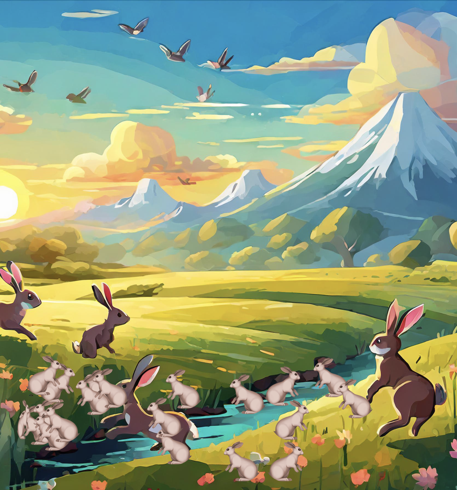

# Project for MIT xPro Full Stack Developer course

## Jumping Rabbits

This project showcases how to create animated rabbit icons in JavaScript that jump across the screen, simulating gravity with a playful appearance against a countryside backdrop.

## Functionality

- Rabbit icons start at random positions on the floor and jump around the screen from left to right.
- Each rabbit has a moderate and varied jump height.
- The rabbits change direction and flip horizontally when they reach the screen edges.
- A countryside backdrop enhances the visual experience.

## Files

- `jumping.html` Main HTML file that includes the canvas and scripts.
- `magic.js` Contains functions to create and manipulate rabbit elements.
- `rabbits.js` Initializes and animates the rabbits.

## How to run

1. Clone the repository.
2. Open jumping.html in a web browser.
3. Preview: <a href="https://ceciliosanchez.com/github/xpro/jumping_rabbits/jumping.html" target="_blank">Jumping Rabbits</a>

## Support

Reach out at http://ceciliosanchez.com/contact/

## License

This project is licensed under the MIT License.
